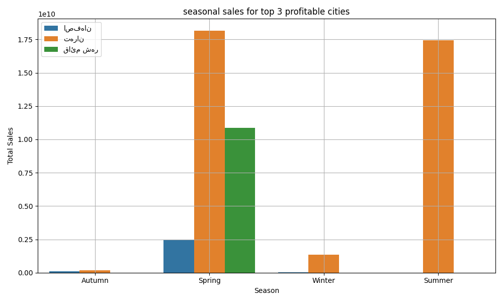
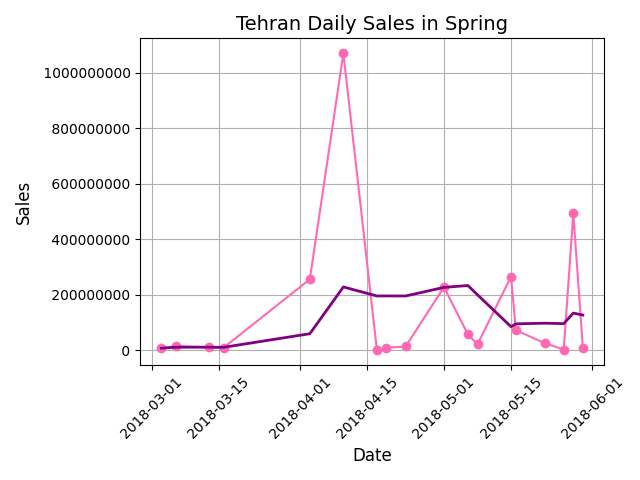

# Digikala Sales Analysis
This project is exploring Digikala sales data using python and pandas
## Project Highlights
- Data cleaning, merging and transformation
- Seasonal revenue trends for top-performing cities
- Identifying top 3 and bottom 3 products in each city
- Moving average smoothing for trend analysis
## Files in the Repo
- digikala.ipynb : Main jupyter Notebook
- df_final.csv : Cleaned dataset
- tarikhche kharid.rar : A compressed file
**Please unzip this file before runing the notebook**
## Sample Visualization

 
  
 

## Tools used
- python 3
- pandas
- matplotlib
---
